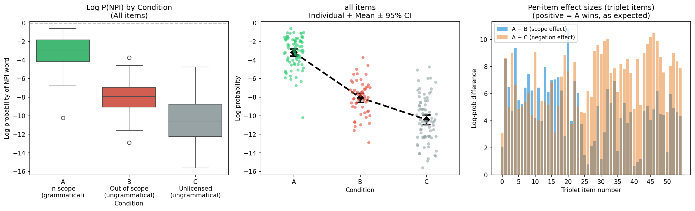
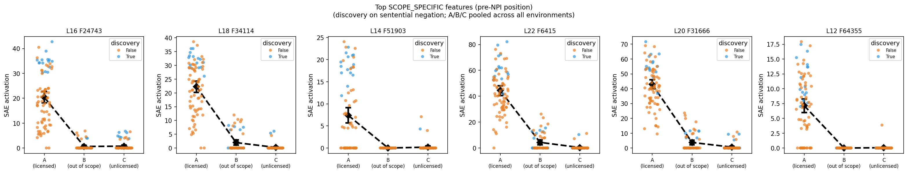
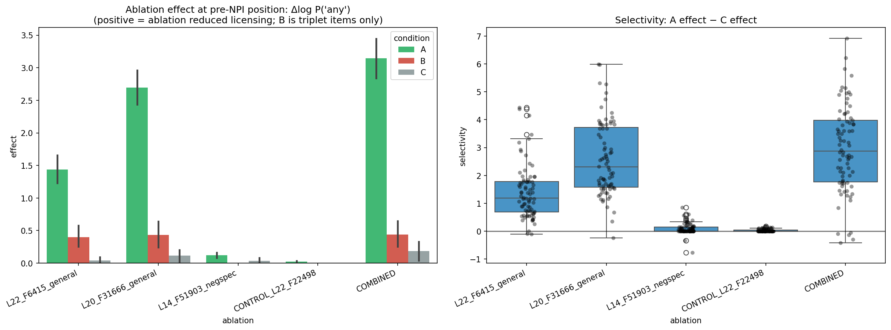

# Do Language Models Represent Negation Scope, or Just Negation Presence?

A mechanistic interpretability study of negative-polarity-item (NPI) licensing in
Gemma-2-2B, using sparse autoencoders (SAEs) to isolate individual features and
causal ablation to test them.

> **Result.** Features discovered using only "not" sentences causally drive the
> model's expectation of a licensed NPI ("any") even in environments with no negation at
> all (questions, "without") so the model encodes an abstract licensing relation, not
> a negation detector. General and negation-specific licensing features doubly dissociate.

---

## Motivation

Negative-polarity items like *any* are grammatical only when licensed:

| | Sentence | Grammatical? |
|---|---|---|
| **A** | The manager did **not** approve **any** proposals. | licensed (in scope) |
| **B** | The manager who did **not** approve the budget reviewed **any** proposals. | licensor out of scope |
| **C** | The manager did approve **any** proposals. | no licensor |

Kletz et al. (2024) used linear probes to ask whether models represent the scope of the
licensor or merely its presence, but probes read distributed signals and cannot isolate
a single causal component. We use SAEs to isolate features and causally ablate them
which is something probes cannot do.

---

## Pipeline

```mermaid
flowchart TD
    S["npi_stimuli.csv&lt;br/&gt;80 items · 5 licensing environments&lt;br/&gt;(single source of truth)"]

    S --&gt; N1["01 · Behavioral&lt;br/&gt;Does P(any) track scope?"]
    S --&gt; N2["02 · Discovery (65k SAE)&lt;br/&gt;Find licensing features at the&lt;br/&gt;PRE-NPI position"]
    S --&gt; N3["03 · Causal Ablation (65k SAE)&lt;br/&gt;Ablate features · measure ΔP(any)"]

    N1 --&gt;|"A ≫ B (d≈2.15)&lt;br/&gt;+ residual B&gt;C (d≈0.74)"| R1["Model tracks scope&lt;br/&gt;(quantifier-driven residual)"]
    N2 --&gt;|"discover on sentential&lt;br/&gt;negation ONLY"| R2["SCOPE_SPECIFIC features&lt;br/&gt;validated on held-out items"]
    N2 --&gt;|"feature indices&lt;br/&gt;(65k-specific)"| N3
    N3 --&gt;|"generalization test on&lt;br/&gt;no / few / question / without"| R3["Abstract licensing&lt;br/&gt;+ double dissociation&lt;br/&gt;+ negative control"]

    R3 --&gt; REV["Reverse ablation&lt;br/&gt;(unlicensed features)"]
    REV --&gt;|"no releasable suppressor"| ASYM["Licensing is&lt;br/&gt;causally ASYMMETRIC"]

    classDef data fill:#fdf2e0,stroke:#c99a3b,stroke-width:1px,color:#4a3a1a;
    classDef nb fill:#e8eef7,stroke:#5b7fa6,stroke-width:1px,color:#1f3247;
    classDef res fill:#e9f2ec,stroke:#6a9c7c,stroke-width:1px,color:#1f3b2c;

    class S data;
    class N1,N2,N3,REV nb;
    class R1,R2,R3,ASYM res;
```
---

## Method Note

All experiments use Gemma 2 2B (Gemma Team, 2024). We analyze residual-stream SAE features from Gemma Scope (Lieberum et al., 2024), specifically the gemma-scope-2b-pt-res-canonical suite at width 65,536 (65k), hosted on HuggingFace. Feature dashboards were inspected via Neuronpedia (Lin & Bloom, 2024). 
An earlier version intervened at the NPI token itself and produced exactly zero effect on every trial. Cause: attention is causal and P(any) is computed from the position before "any", so an intervention at/after that token cannot affect it. The fix is to intervene at the pre-NPI position.

---

## Repository layout

```
.
├── README.md
├── requirements.txt
├── stimuli/
│   └── npi_stimuli.csv            # 80 items, 5 environments
├── notebooks/
│   ├── 01_behavioral.ipynb        # behavioral validation
│   ├── 02_discovery_prenpi.ipynb  # 65k SAE feature discovery
│   └── 03_ablation_prenpi.ipynb   # causal ablation + reverse test
├── results/
│   ├── figures/                   # plots referenced below
│   └── tables/                    # 03_ablation_full.csv, 02_validated_features.csv, ...
└── PROJECT_LOG.md                 # full design-decision + error log
```

---

## Results

### 1. Behavioral
Log P(any) is far higher when the NPI is in scope (A) than out of scope (B) or unlicensed (C).
Scope dominates (**A ≫ B, d ≈ 2.15**); a smaller residual-presence effect (B > C,
d ≈ 0.74, p < .001) appears, driven by quantifier environments i.e. a trapped "few"/"no"
leaks some licensing signal, a trapped "not" does not.



### 2. Discovery

65k-width GemmaScope SAEs yield features that fire strongly in A and near-zero in B/C,
validated on held-out items (t up to 35, p < 1e-9). Discovery used sentential negation
only; all other environments were held out for generalization.



### 3. Causal ablation

Ablating the discovered features reduces P(any) selectively in condition A, far above
the SAE reconstruction noise floor, and in environments with no negation
at all (questions, "without"). A negation-specific feature dissociates cleanly (works only
under negation); a negative control shows no effect.



| Ablation target | Δlog P(any) in A | Selectivity (A−C) | Generalizes to no-negation envs? |
|---|---|---|---|
| L20 F31666 (general) | **+2.69** (~4× noise floor) | d ≈ 1.95, p < 1e-6 | yes |
| L22 F6415 (general) | **+1.44** | d ≈ 1.44, p < 1e-6 | yes |
| L14 F51903 (negation-specific) | +0.32 (neg only) | small | zero in no/few/question |
| L22 F22498 (control) | +0.03 | ~100× smaller | null, as intended |
| COMBINED (top 3) | **+3.15** | d ≈ 1.90 | yes |

### 4. Reverse test

Ablating features that fire for unlicensed NPIs did not raise P(any) (small effects,
wrong direction, vanish when combined). This suggests that the model maintains a positive, causally-efficacious
representation of licensed NPIs but no releasable suppressor of unlicensed ones.

### 5. Qualitative validation

Each feature's natural web-text behavior matches its causal role: general features have
polarity-item logits (anything, anymore, anywhere, anyone) and fire across constructions;
the negation-specific feature fires on "not V"; the control fires on formulaic temporal
"any" (at any time). This convergence argues the causal effects are not SAE artifacts.

---

## Findings at a glance

- **Primary.** Model tracks scope behaviorally; SAE features at the pre-NPI position
  causally drive NPI expectation; the effect generalizes to negation-free licensing →
  abstract licensing representation.
- **Secondary.** Double dissociation (general vs negation-specific features);
  distributed/redundant coding (COMBINED > individual).
- **Tertiary.** Systematic environment gradient (few/no > negation > without > question);
  licensing is causally asymmetric (no suppressor); negative control behaves as required.
- **Methods.** (1) Causal ablation of a token's probability must intervene upstream of
  that token. (2) SAE width lowers the reconstruction noise floor and gates detectable
  effects; report magnitude separately from significance.

See [`PROJECT_LOG.md`](PROJECT_LOG.md) for the full design-decision and error record.

---

## Reproducing

**Environment.** Kaggle (GPU P100, or T4×2 pinned to a single device). Enable Internet;
store a Hugging Face token (with Gemma-2 access) in Kaggle Secrets as `HF_TOKEN`; attach
`stimuli/npi_stimuli.csv` as a Kaggle Dataset.

**Key invariants:** intervene and measure at the pre-NPI position (`any_pos − 1`);
`forward_pre_hook` on layer L+1 with `use_cache=False`; 65k feature indices only; A-vs-B stats on triplet items, A-vs-C on all items.

---

## References

- Kletz, D., Candito, M., & Amsili, P. (2024). Probing structural constraints of negation in Pretrained Language Models. In Proceedings of the 24th Nordic Conference on Computational Linguistics (NoDaLiDa), pp. 541–554, Tórshavn, Faroe Islands. arXiv preprint arXiv:2408.03070. https://arxiv.org/abs/2408.03070
- Lieberum, T., Rajamanoharan, S., Conmy, A., Smith, L., Sonnerat, N., Varma, V., Kramár, J., Dragan, A., Shah, R., & Nanda, N. (2024). Gemma Scope: Open Sparse Autoencoders Everywhere All At Once on Gemma 2. arXiv preprint arXiv:2408.05147. https://arxiv.org/abs/2408.05147
- Gemma Team (2024). Gemma 2: Improving Open Language Models at a Practical Size. arXiv preprint arXiv:2408.00118. https://arxiv.org/abs/2408.00118
- Lin, J. & Bloom, J. (2024). Neuronpedia: Interactive reference and tooling for analyzing neural networks. https://neuronpedia.org
